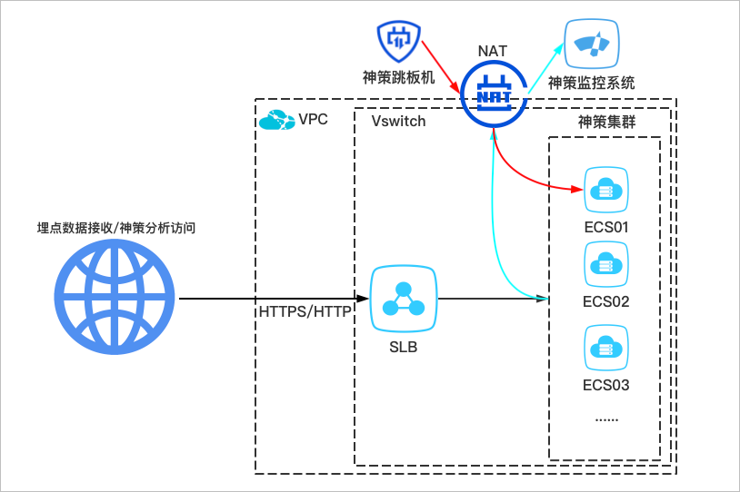
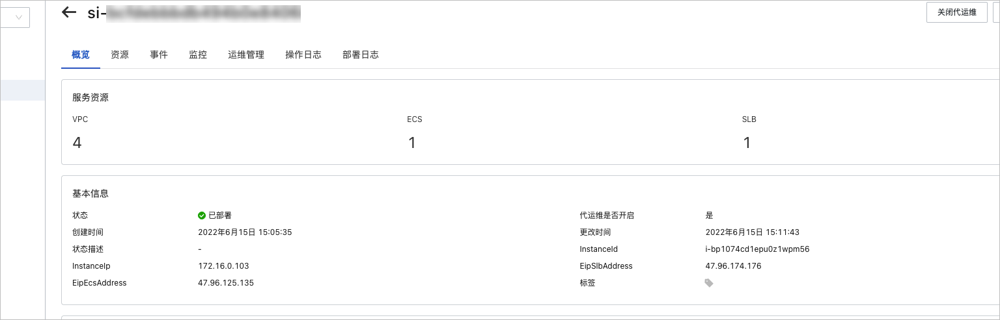

神策分析服务实例部署文档 
=================================
>**免责声明：**本文档可能包含第三方产品信息，该信息仅供参考。阿里云对第三方产品的性能、可靠性以及操作可能带来的潜在影响，不做任何暗示或其他形式的承诺。

概述 
-----------------------

神策分析是驱动业务的全场景数据分析平台。通过整合全域用户行为、业务经营等多种数据源，结合十大分析模型高度抽象用户行为，提供多维度、多指标的交叉分析能力，全面支撑各团队的日常数据分析与用户洞察的需求，驱动业务决策。在计算巢部署模式中，您可以通过神策在计算巢中发布的服务，一键部署阿里云资源和神策分析环境。神策分析是驱动业务的全场景数据分析平台。通过整合全域用户行为、业务经营等多种数据源，结合十大分析模型高度抽象用户行为，提供多维度、多指标的交叉分析能力，全面支撑各团队的日常数据分析与用户洞察的需求，驱动业务决策。本文介绍部署神策分析服务实例的详细信息。

计费说明 
-------------------------

本实例包含阿里云资源和神策分析应用的费用。阿里云资源的费用根据部署时选择的资源不同而不同，具体费用请在部署时参考询价信息。神策分析应用的费用请咨询您的服务商。

RAM账号所需权限 
------------------------------

神策分析服务需要对部分阿里云资源进行访问和创建操作，若您使用RAM账号创建服务实例，则需要在创建服务实例前，对使用的RAM账号添加相应资源的权限。添加RAM权限的详细操作，请参见[为RAM用户授权](https://help.aliyun.com/document_detail/116146.htm)。

若您使用的是阿里云主账号创建服务实例，则不需要添加权限。

|             权限策略名称              |             备注             |
|---------------------------------|----------------------------|
| AliyunVPCFullAccess             | 管理专有网络（VPC）的权限             |
| AliyunNATGatewayFullAccess      | 管理NAT网关（NAT Gateway）的权限    |
| AliyunEIPFullAccess             | 管理弹性公网IP（EIP）的权限           |
| AliyunECSFullAccess             | 管理云服务器服务（ECS）的权限           |
| AliyunTagAdministratorAccess    | 管理标签服务（TAG）和所有阿里云产品标签的权限   |
| AliyunCloudMonitorFullAccess    | 管理云监控（CloudMonitor）的权限     |
| AliyunSLBFullAccess             | 管理负载均衡服务（SLB）的权限           |
| AliyunROSFullAccess             | 管理资源编排服务（ROS）的权限           |
| AliyunComputeNestUserFullAccess | 管理计算巢服务（ComputeNest）的用户侧权限 |

神策分析服务资源说明 
-------------------------------

创建神策分析服务实例时，服务将自动在您的账号下创建所需的云资源。创建的资源如下表所示：

|       资源名称       | 数量 |                                                                                                                                                                                                                                                                                                                                                                                   说明                                                                                                                                                                                                                                                                                                                                                                                   |
|------------------|----|------------------------------------------------------------------------------------------------------------------------------------------------------------------------------------------------------------------------------------------------------------------------------------------------------------------------------------------------------------------------------------------------------------------------------------------------------------------------------------------------------------------------------------------------------------------------------------------------------------------------------------------------------------------------------------------------------------------------------------------------------------------------|
| 交换机              | 1  | 划分子网，连接对应的云资源。                                                                                                                                                                                                                                                                                                                                                                                                                                                                                                                                                                                                                                                                                                                                                         |
| NAT网关+EIP        | 1  | 提供公有网络访问服务。规格费按量付费，网络按流量计费，默认带宽5 M。                                                                                                                                                                                                                                                                                                                                                                                                                                                                                                                                                                                                                                                                                                                                    |
| SNAT规则           | 无  | ECS通过NAT出网访问公网，主要用于上报服务监控指标。                                                                                                                                                                                                                                                                                                                                                                                                                                                                                                                                                                                                                                                                                                                                           |
| DNAT规则           | 无  | DNAT到集群中第一个节点，主要用于神策运维人员通过跳板机进行远程SSH连接。                                                                                                                                                                                                                                                                                                                                                                                                                                                                                                                                                                                                                                                                                                                                |
| 安全组以及相应规则        | 无  | 设置规则如下： 出网不限制。  入网SSH端口添加神策跳板机白名单，主要用于神策运维人员处理报警以及日常需求。                                                                                                     |
| 根据部署架构创建ECS云主机实例 | n  | 根据不同情况进行创建。 单机：创建1个混合节点的ECS实例。   MINI集群：创建2个混合节点的ECS实例。    标准集群：创建3个元数据节点的ECS实例和N个数据节点的ECS实例。                                                                                                                                                                                                                                                                                                                                                                                                                                                                                                                                                |
| SLB+EIP以及相应转发规则  | 1  | SLB+EIP：实例规格类型选择slb.s3.large，实例规格的付费类型为按量付费。带宽上限为200 Mbps，网络的付费方式为按流量计费。带宽可支撑的导入量，请参见[使用神策分析采集用户行为数据，需要多大的带宽？](https://manual.sensorsdata.cn/sa/latest/%E8%B4%B9%E7%94%A8%26%E6%9C%8D%E5%8A%A1%E9%97%AE%E9%A2%98-34537496.html#id-.%E8%B4%B9%E7%94%A8&%E6%9C%8D%E5%8A%A1%E9%97%AE%E9%A2%98v2.3-%E4%BD%BF%E7%94%A8%E7%A5%9E%E7%AD%96%E5%88%86%E6%9E%90%E9%87%87%E9%9B%86%E7%94%A8%E6%88%B7%E8%A1%8C%E4%B8%BA%E6%95%B0%E6%8D%AE%EF%BC%8C%E9%9C%80%E8%A6%81%E5%A4%9A%E5%A4%A7%E5%B8%A6%E5%AE%BD%EF%BC%9F)  转发规则：  * 端口为443且面向公网开放时，转发到神策8106端口用来接收埋点数据。若选择了SSL证书时，将自动转成HTTPS协议。   * 端口为8107且面向公网开放时，转发到神策8107端口作为神策分析系统登录界面。若选择了SSL证书将自动转成HTTPS协议。   |

创建神策分析服务实例时，新建的云资源的用途，如下图所示。

部署流程 
-------------------------

**部署步骤**

在计算巢部署模式中，您可以通过神策在计算巢中发布的服务，一键部署阿里云资源和神策分析环境。

1. 单击神策服务部署链接，进入服务实例部署界面。

2. 根据界面提示，完成服务实例的部署。

**部署参数说明**

您在创建服务实例的过程中，需要配置服务实例信息，下文介绍神策服务实例输入参数和输出参数的详细信息。

* **输入参数**

  在创建服务实例的过程中，您需要配置的服务实例信息如下表所示：
  

  |  输入参数   |   默认值   |  说明  |
  |--------------|---------------|----------------|
  | 地域  | 华东1（杭州） | 请根据实际需要选择部署的服务器所在地域，神策分析目前适用于任何地域。  不同地域可选的机器规格可能不一致，当某些地域没有可选机型时，则需要重新选择地域。 |
  | CDKEY  | 无       | 购买神策服务时，由神策提供CDKEY，该CDKEY是创建神策分析必需的唯一密钥。  如果密钥填写错误，会导致服务实例部署失败。|
  | 套餐配置 | 预置套餐    | 选择服务器的配置规格套餐，将自动填好以下参数，方便您快速完成填写。包括机型、CPU、内存、磁盘（系统盘、元数据盘、随机数据盘、数据接收盘、顺序数据盘）。 若您选择的套餐中没有预置机型，也可以通过自定义套餐的方式选择可选机型，磁盘规格等参数。 |
  | 计费方式          | 预付费，包年包月       | 选择本次购买服务器的计费方式。 计费方式分为按量付费和预付费，包年包月两种。计费方式的详细说明，请参见[计费方式概述](https://help.aliyun.com/document_detail/25370.htm)。 |
  |  购买时长          | 1              | 设置预付费的时长，只有计费方式选择预付费，包年包月时需要配置。 |
  |  包年包月购买周期      | 年              | 选择预付费的单位，只有计费方式选择预付费，包年包月时需要配置。|
  | 实例密码          | 无              | 设置服务器登录密码。长度为8\~30个字符，必须包含三项（大写字母、小写字母、数字、 ()\`\~!@#$%\^\*_-+=\{} \[\]:;',.?/ 中的特殊字符）。 |
  | 系统盘规格         | 高效云盘/50        | 选择服务器的系统盘类型并设置规格。 系统盘类型包括高效云盘、SSD盘和ESSD云盘。此处推荐选择高效云盘。 随机数据盘的单位为GiB。取值范围：50\~500。  |
  |元数据盘规格        | ESSD云盘/250     | 选择服务器的元数据盘类型并设置规格。 元数据盘类型包括SSD盘和ESSD盘两种。此处推荐选择SSD或者ESSD盘。 元数据盘的单位为GiB。可选范围：250\~32768。 |
  | 随机数据盘规格       | ESSD云盘/250     | 选择服务器的随机数据盘类型并设置规格。 随机数据盘类型包括SSD盘和ESSD盘两种。此处推荐选择SSD或者ESSD盘。 随机数据盘的单位为GiB。取值范围：250\~32768。 |
  | 数据接收盘规格       | 高效云盘/300       | 选择服务器的数据接收盘类型并设置规格。 数据接收盘类型包括高效云盘、SSD盘和ESSD云盘。此处推荐选择高效云盘。 数据接收盘的单位为GiB。取值范围：300\~32768。 |
  | 顺序数据盘规格       | 高效云盘/1000/3    | 选择服务器的顺序数据盘类型、大小规格和数量。 顺序数据盘的类型包括高效云盘、SSD盘和ESSD盘，此处推荐选择高效云盘。 顺序数据盘的单位为GiB。取值范围：1000\~32768。 可选择多块数据盘，默认值为3。                                                                                                                                                |
  | 可用区           | 无              | 根据已选择的ECS规格和实际需求，选择对应的可用区。可用区的详细信息，请参见[地域和可用区](https://help.aliyun.com/document_detail/188196.htm)。                                                                                                                                                                                          |
  |  VPC           | 无              | 神策用来放置云资源的VPC，推荐新建一个或使用全新的VPC，避免模板创建资源时发生冲突，导致部署失败。                                                                                                                                                                                                                                        |
  | 填写交换机子网IPv4网段 | 192.168.1.0/24 | 云资源所在的子网网段。                                                                                                                                                                                                                                                                                |
  | NTA网关带宽       | 5              | 部署神策环境是，以实现在所选择的VPC下创建一个NAT网关的出网访问。如无特殊规划，推荐保持默认值。 带宽的取值范围：1\~200 Mbps，默认值为5。                                                                                                                                                                                                              |
  |  数据接收域名        | 无              | 设置用于上报、接收数据的域名地址，对应服务器的8106端口。 若您未准备域名，可先不填写，后续在登录环境时手动配置。详细操作，请参见[服务转发配置文档](https://manual.sensorsdata.cn/sa/latest/https-7539390.html)。  此处输入的域名只会进行神策配置的更新，需要您自行备案和设置DNS解析。                                                                    |
  | 分析页面域名        | 无              | 用于访问神策分析页面的域名地址，对应服务的8107端口。 若您未准备域名，可先不填写，后续在登录环境时手动配置。详细操作，请参见[服务转发配置文档](https://manual.sensorsdata.cn/sa/latest/https-7539390.html)   此处输入的域名只会进行神策配置的更新，需要您自行备案和设置DNS解析。                                                                       |
  | 数据接收域名证书      | 无              | 选择或新建接收域名使用的SSL证书。若需要通过公网上报和接收数据时，建议都使用HTTPS协议。   选择SSL证书后，SLB数据接收端口443将会自动配置HTTPS协议。 未选择证书时，SLB数据接收端口443将会自动配置HTTP协议。 |
  | 分析页面域名证书      | 无              | 选择或新建接收域名使用的SSL证书。若需要通过公网上报和接收数据时，建议都使用HTTPS协议。  选择SSL证书后，SLB数据接收端口443将会自动配置HTTPS协议。 未选择证书时，SLB数据接收端口443将会自动配置HTTP协议。  若分析页面和数据接收域名相同，则可以选择同一个泛域名证书。   |
  | 联系人分组         | 云账号报警联系人       | 选择联系人分组。此分组是用来接收神策云资源报警通知。 神策分析服务实例的报警规则，请参见[报警规则说明](https://help.aliyun.com/document_detail/434178.html)。|
  | 标签            | 无              | 指定本次创建的资源所绑定的标签。推荐给神策所有云资源打上标签，便于区分和计费系统中查看。 |
  |  资源组           | 无              | 指定本次创建的资源所归属的资源组。推荐将神策所有云资源放在特定的资源组，便于区分和计费系统中查看。 |

  

  

* **输出参数**

  服务实例创建完成后，服务实例详情中会展示部署结果和神策环境配置信息。详细信息如下表所示：
  

  |     输出参数      |                                                                                                                            说明                                                                                                                            |
  |---------------|----------------------------------------------------------------------------------------------------------------------------------------------------------------------------------------------------------------------------------------------------------|
  | EipSlbAddress | 该服务实例创建的SLB EIP，对公网开放用来接收埋点数据和访问神策分析页面的IP地址，通常需要解析到您为神策分析准备的域名。 配置解析域名后，您可以通过以下方式进行测试：  使用域名:443的方式测试数据接收地址是否正确。   使用域名:8107的方式检测访问神策分析的地址是否正确。   |
  | Instanceld(s) | 创建的ECS ID列表。                                                                                                                                                                                                                                             |
  | Instancelp(s) | 创建的ECS内网IP列表。                                                                                                                                                                                                                                            |
  | EipEcsAddress | 创建的ECS DNAP IP，用于SSH连接ECS。若未开通安全组，则只能通过控制台登录ECS。                                                                                                                                                                                                 |

  

  

报警规则说明 
---------------------------

神策分析服务实例的报警规则如下：

* ECS实例相关的报警规则：
  * CPU使用率＞90%且持续超过60分钟时报警，报警级别为：info。云监控会通过邮件的方式通知报警联系组。
  
  * 磁盘使用率＞＝95%且持续超过15分钟时报警，报警级别为：warn。云监控会通过短信+邮件的方式通知报警联系组。
  
  * 磁盘使用率＞＝ 90%且持续超过60分钟时报警，报警级别为：info。云监控会通过邮件的方式通知报警联系组。
  
  * 内存使用率＞90%且持续超过60分钟时报警，报警级别为：info。云监控会通过邮件的方式通知报警联系组。
  

  

* 负责均衡相关报警规则：
  * 最大连接数使用率/新建连接数使用率/实例网络流出带宽使用率\>=100%且持续3分钟时报警，报警级别为：critical。云监控会通过电话+短信+邮件的方式通知报警联系组。
  
  * 最大连接数使用率/新建连接数使用率/实例网络流出带宽使用率\>=90%且持续15分钟时报警，报警级别为：warn。云监控会通过短信+邮件的方式通知报警联系组。
  
  * 最大连接数使用率/新建连接数使用率/实例网络流出带宽使用率\>=80%且持续30分钟时报警，报警级别为：info。云监控会通过邮件的方式通知报警联系组。
  
  * 实例流入带宽\>=200 Mbits且持续3分钟时报警，报警级别为：critical。云监控会通过电话+短信+邮件的方式通知报警联系组。
  
  * 实例流入带宽\>=180 Mbits且持续3分钟时报警，报警级别为：warn。云监控会通过短信+邮件的方式通知报警联系组。
  
  * 实例流入带宽\>=160 Mbits且持续3分钟时报警，报警级别为：info。云监控会通过邮件的方式通知报警联系组。
  
  * 实例丢失连接数\>=5/s且持续3分钟时报警，报警级别为：critical。云监控会通过电话+短信+邮件的方式通知报警联系组。
  

  

